# Python AWS

## AWS CLI
- Neste ponto o usuário deve ter realizado o cadastro na AWS previamente.

## Instalando a aws cli
`Em um terminal, de preferência na home, rodar as seguintes linhas de comando, para o caso de utilizar sistema linux:`
- Baixando o pacote:
    - curl "https://awscli.amazonaws.com/awscli-exe-linux-x86_64.zip" -o "awscliv2.zip"
- Descompactando o conteúdo baixado:
    - unzip awscliv2.zip
- Finalmente, instalando:
    - sudo ./aws/install
- Após a instalação, a versão instalada poderá ser conferida rodando:
    - aws --version

## Configurando a variável de ambiente
- Segundo este trecho da documentação, [Aqui](https://docs.aws.amazon.com/cli/latest/userguide/cli-configure-envvars.html), é necessário que você consiga os seguintes valores:
    - 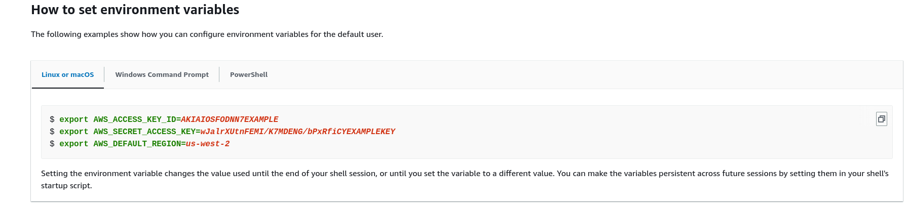
    - No entanto, não podemos usar estes valores, pois são apenas um exemplo.

- Precisamos criar um grupo de usuários, acessando [criar grupo](https://us-east-1.console.aws.amazon.com/iamv2/home?region=us-east-2#/groups/create).

- Cada grupo pode ter até 10 permissões diferentes, para os produtos da aws.
    - 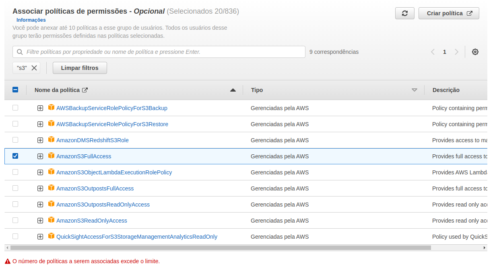

- Com o grupo criado, devemos agora adicionar um usuário ao grupo:
    - 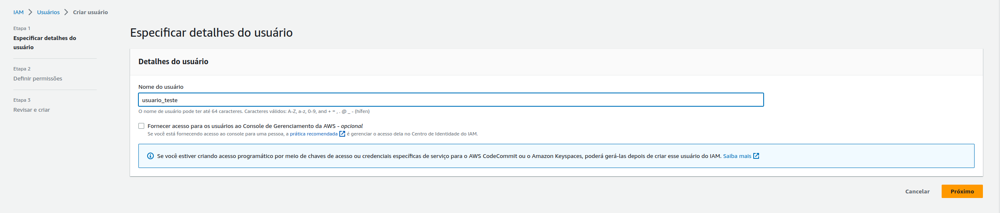

- Em seguida adicione este usuário ao grupo:
    - 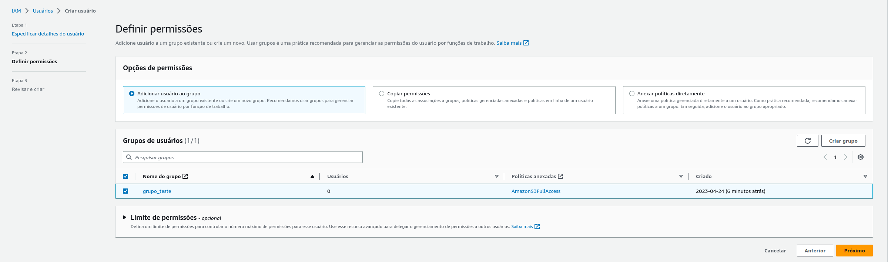

- A permissão estará adicionada ao usuário do grupo:
    - 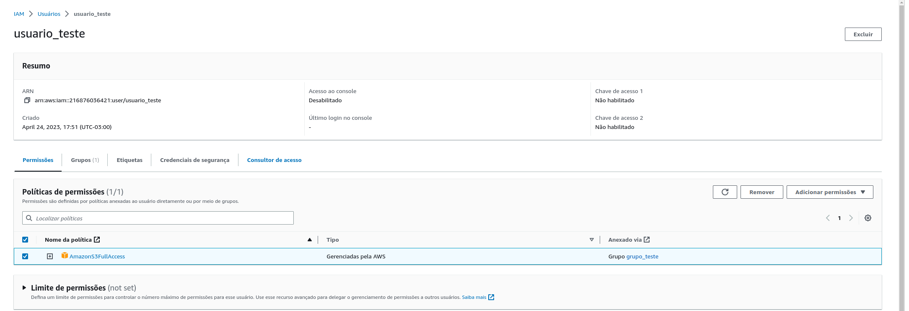

- Então, devemos criar uma chave de acesso:
    - 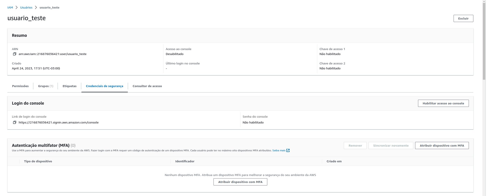
    - 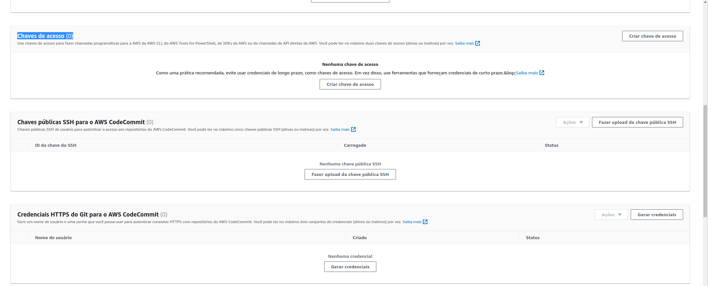

- E definindo seu tipo de chave de acesso, de acordo com sua necessidade:
    - 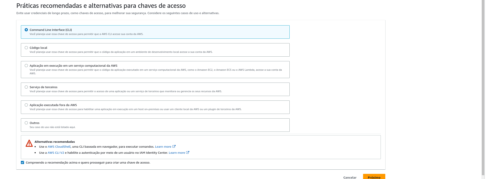

- Define etiqueta(opcional):
    - 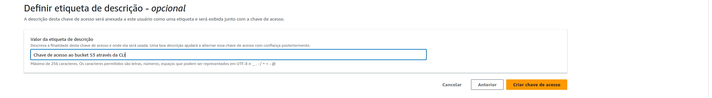

- Por fim, você será direcionado a esta página, onde pode baixar o csv das credenciais:
    - 

- O csv terá a seguinte estrutura:
    - 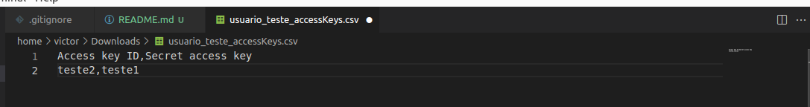

- Setamos esta configuração no cli:
    - 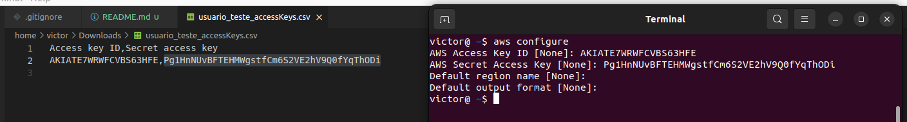

- E finalmente, já podemos utilizar o nosso cli:
    - 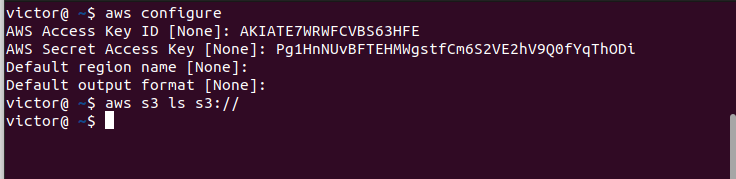

- Agora, podemos usar estas credenciais para utilização da ferramenta de CLI, como definimos sua permissão ao criar a chave, uma mesma chave não deve funcionar no CLI e através de algum script, como python.
